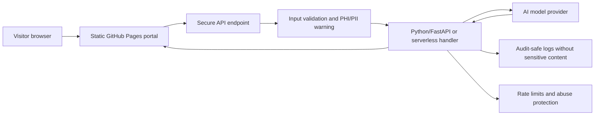

# Secure AI Architecture

{: .lead }
The live portal is intentionally static-safe. It can guide visitors, generate briefs, and surface evidence without sending data anywhere. Real AI model calls should be added only through a secure backend.

## Why Not Put AI Keys in the Browser?

API keys must never be exposed in client-side JavaScript. A GitHub Pages site is public, so any key placed in browser code can be copied and abused. A serious AI-enabled public health portal needs a backend boundary.

## Recommended Architecture



## Backend Features To Add Later

- **AI collaboration assistant:** convert visitor context into structured scoping questions, deliverables, stakeholder maps, and follow-up drafts.
- **Public health brief generator:** produce leadership-ready summaries using de-identified inputs and clear uncertainty language.
- **Teaching design assistant:** map competencies to objectives, activities, assessments, and rubric drafts.
- **Evidence navigator:** retrieve relevant pages, publications, and artifacts from the site without requiring visitors to browse manually.
- **Admin review mode:** allow generated text to be reviewed before it is used in professional communication.

## Python/FastAPI Endpoint Shape

```python
from fastapi import FastAPI
from pydantic import BaseModel, Field

app = FastAPI(title="Rauf Shah Public Health AI Portal")

class CollaborationRequest(BaseModel):
    audience: str = Field(max_length=80)
    topic: str = Field(max_length=120)
    context: str = Field(max_length=2000)

@app.post("/api/collaboration-brief")
async def collaboration_brief(request: CollaborationRequest):
    # 1. Reject PHI/PII-like content.
    # 2. Apply rate limits and abuse checks.
    # 3. Call the AI provider with a server-side API key.
    # 4. Return structured JSON for the frontend.
    return {
        "summary": "Draft collaboration summary",
        "questions": [],
        "next_steps": [],
    }
```

## Governance Principles

- No protected health information or identifiable patient details.
- No hidden automated decisions about people, eligibility, employment, or services.
- Clear disclosure when content is AI-assisted.
- Human review before professional, academic, or public health use.
- Minimal logging, no sensitive content retention, and transparent contact pathways.

## Deployment Options

- **Keep GitHub Pages for the public site** and add a separate secure API on Render, Fly.io, Azure Functions, AWS Lambda, or another managed platform.
- **Use environment variables** for model API keys and never commit secrets to the repository.
- **Add request limits** before opening any public endpoint.
- **Use structured JSON outputs** so the frontend can display consistent, reviewable results.
